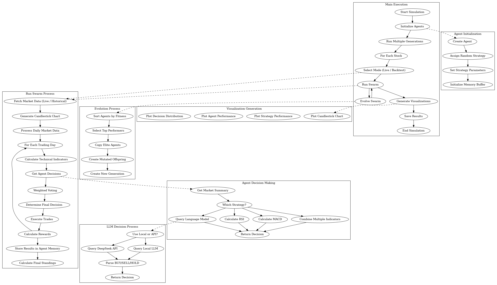

# 🧠 Swarm Brain: An LLM-Powered, Evolving Trading Intelligence

A multi-agent, self-optimizing trading system combining swarm intelligence, strategy evolution, and large language model reasoning.

## 🔍 Features

- **Swarm Intelligence Core**  
  Agents explore and compete using diverse strategies (RSI, MACD, Hybrid, LLM).

- **LLM Integration**  
  DeepSeek API + local fallback (Phi or equivalent) for real-time market analysis.

- **Dual Operation Modes**
  - **Phase 1:** Live simulation with agent voting and paper trading  
  - **Phase 2:** Historical backtesting + swarm evolution

- **Evolutionary Learning**  
  Agents are scored, ranked, cloned, and mutated across generations to maximize profit.

- **Hybrid Decision Making**  
  Combines technical indicators with LLM insights + swarm consensus.

- **Visualization Tools**  
  Strategy performance, agent fitness trends, decision distributions.

## 🛠 Tech Stack

- Python / NumPy / Pandas / Matplotlib  
- DeepSeek LLM API (with local fallback option)  
- Custom Evolution Engine  
- Modular Strategy Layer (plug-and-play)

## 🚧 Roadmap

- [x] Swarm core + agent manager  
- [x] LLM-driven strategy layer  
- [x] Paper trading simulator  
- [x] Evolutionary learning framework  
- [ ] Real-time deployment hooks  
- [ ] Frontend dashboard (optional)

## 📎 Example Flow

1. Pull live or historical data  
2. Analyze market trends using LLMs  
3. Spawn diverse agents to simulate trades  
4. Vote + evaluate strategies  
5. Evolve swarm for next round

  

## 📈 Result

  

A truly adaptive, self-improving market analyzer—where every trade trains the brain.

---

Want to contribute? Fork, test, and build a smarter swarm 🐜
